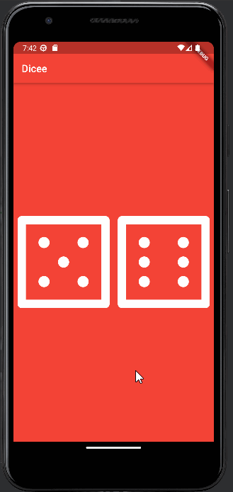

# Dicee 🎲

Application de lancement de dé réalisée avec Flutter.
Ce projet est issu d'une [formation](https://www.udemy.com/course/flutter-bootcamp-with-dart/) complete sur udemy dispensée par Angela Yu.
Je suis cette formation en vue d'un stage en mai sur leauel je serais ammené a travailler sur Flutter.

Cette application met en place l'apsect dynamique de l'aplication : au clic d'un dé, les valeurs changent.
On a utilisé les outils suivants :
- StateLessWidget
- StateFullWidget
- variables typées : int, string, etc.
- fonctions : sans arguments et sans return
- Package Dart:Math : pour générer des nombres aléatoires entre 1 et 6 `Random().nextInt(6) + 1`
- Expanded : widget permettant d'adapter proportionnellement la taille d'un widget a l'interieur d'une ligne par rapport à la taille de l'écran et des autres élément dans la ligne
- TextButton : et la propriété `onPressed` pour rendre le contenu interactif
- $ : dans des strings pour utiliser une variable
- setState() : pour modifier une variable afin de déclencher la mise a jour de l'affichage

# Materiel

- Flutter
- Android Studio
- Tablette Lenovo M-10 / Android 10
- Emulateur Pixel 3a / Android 13

# Ressources

- [Udemy / Angela Yu](https://www.udemy.com/course/flutter-bootcamp-with-dart/)
- [Doc Flutter Widget](https://docs.flutter.dev/ui/widgets)

# Fichier principaux

- Code Flutter : [lib/main.dart](lib/main.dart)
- Configuration : [pubspec.yaml](pubspec.yaml)
- faces de dés : [images/](images)

# Example

